# NIT Rourkela Academic Marks Management System (MMS)

A complete, production-style responsive ERP web application designed as a B.Tech Computer Science academic project for **National Institute of Technology Rourkela**. 

This system provides a digital panel for managing student evaluation scores (Pre-Mid and Post-Mid Semesters), registering student courses, setting up semester sessions, and allocating course coordinates. It features role-based access control and is styled with a sleek NIT Rourkela theme.

---

## 🚀 Key Features

1. **ERP-style Dashboard**: Displays real-time aggregate statistics (Total Students, Subjects, Faculty, and active session) and an audit trail log.
2. **Academic Sessions**: CRUD management for school terms with a toggle system to activate sessions.
3. **Semester Manager**: Tracks term cohorts linked to sessions.
4. **Subject Catalog**: Map courses with credit allocations, assign **one Course Coordinator** and **multiple Sub-Coordinators**.
5. **Faculty Roster**: Directory listing of staff mapped to roles and departments.
6. **Student Directory**: Student profile registries with advanced branch, semester, and name query filters.
7. **Marks Entry Sheet**: Restricted teacher sheets featuring strict real-time validations (Pre-Mid Sem $\le 30$, Post-Mid Sem $\le 70$).
8. **Performance Reports**:
   - **Student-wise Transcript**: Grade report and weighted SGPA calculator.
   - **Subject-wise Grade Card**: Class averages, peak scores, pass percentage, and a **dynamic SVG bar chart** showing grade scales.
   - **Semester Ledger**: Student scores aggregate comparisons.
9. **Export Formats**: Simulated client-side **Excel/CSV download** and clean **PDF layout prints** using CSS media states.
10. **Profile Settings**: Personal panel to edit profile fields or change login passwords.
---

## 📷 System Screenshots

### 1. Authentication & Dashboard
| Login Portal | System Admin Dashboard |
| :---: | :---: |
| 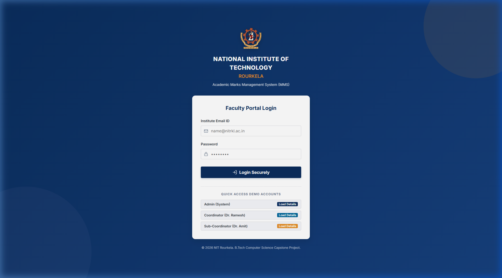 | 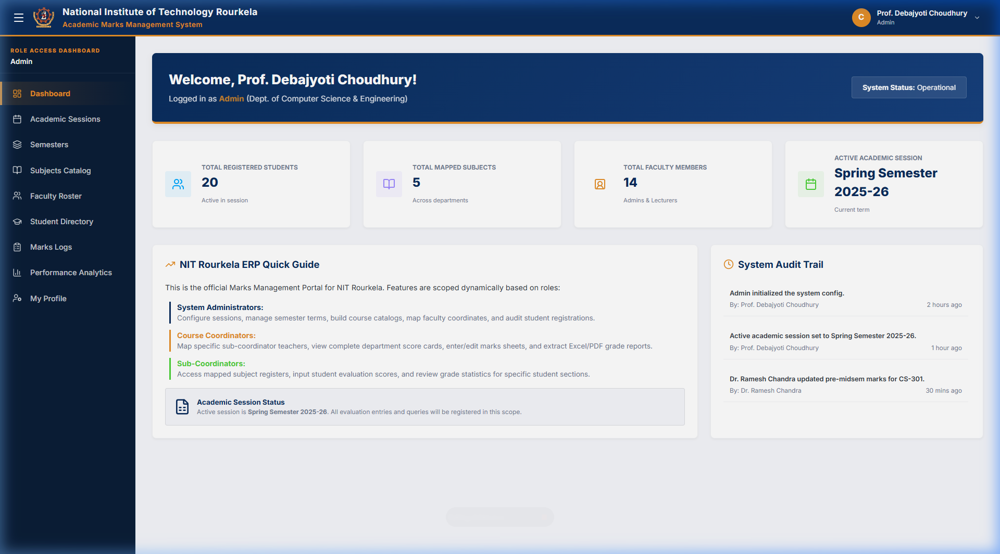 |

### 2. Academic Configurations
| Academic Sessions | Semester Management |
| :---: | :---: |
| 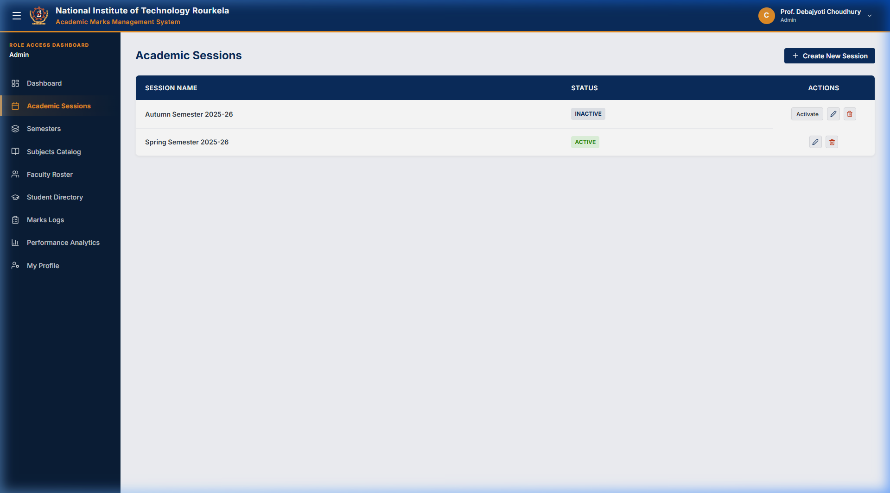 | 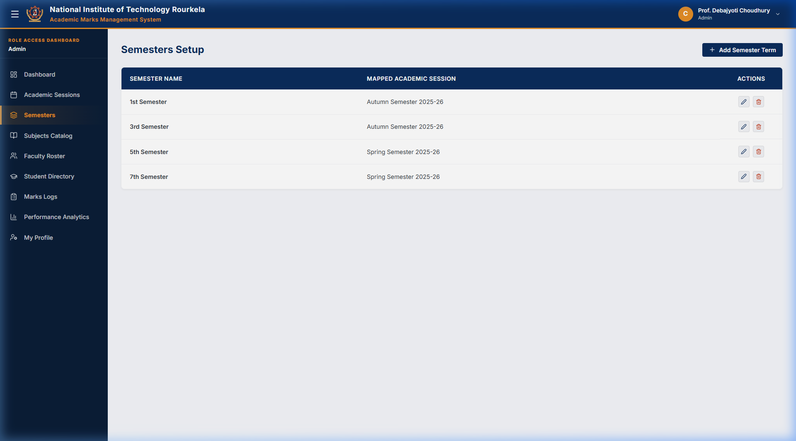 |

### 3. Registry & Catalogs
| Subject Catalog | Faculty Roster |
| :---: | :---: |
| 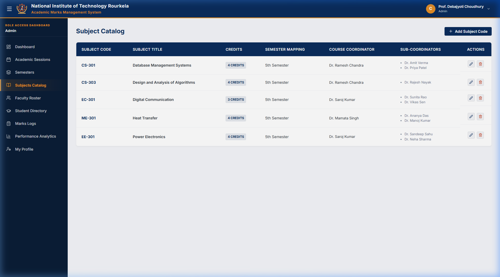 | 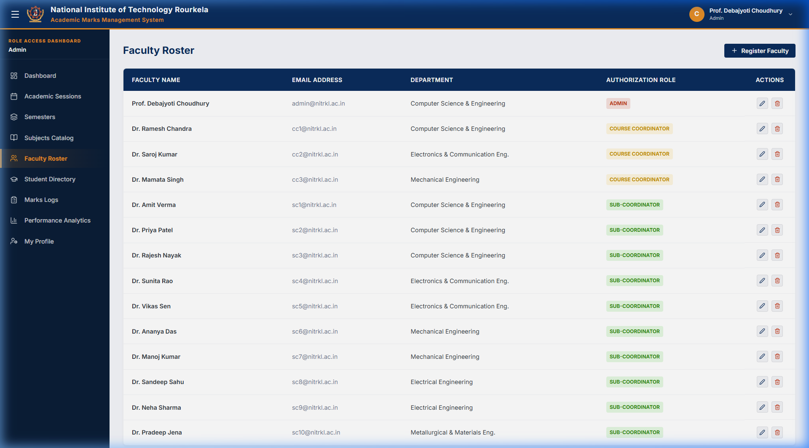 |

### 4. Student & Marks Management
| Student Directory | Marks Logs |
| :---: | :---: |
| 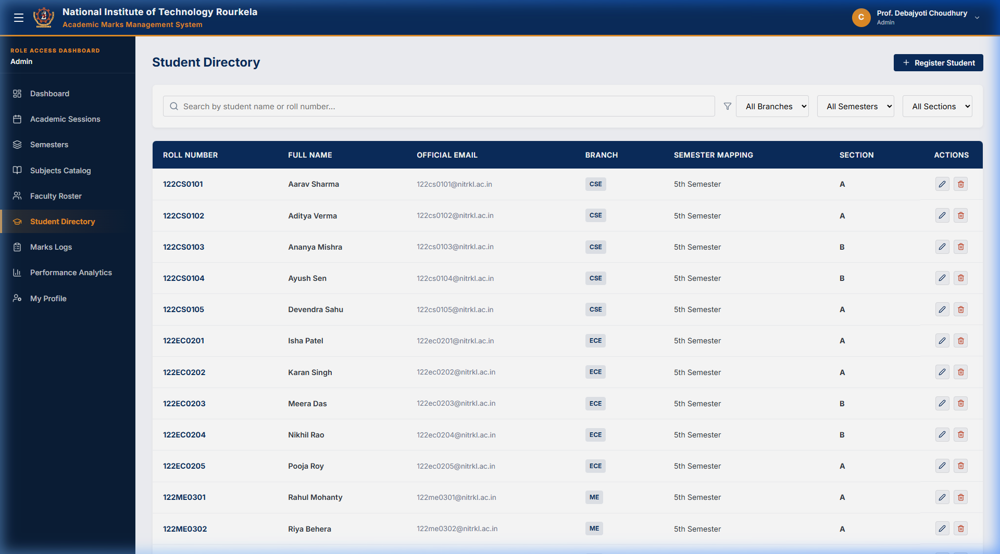 | 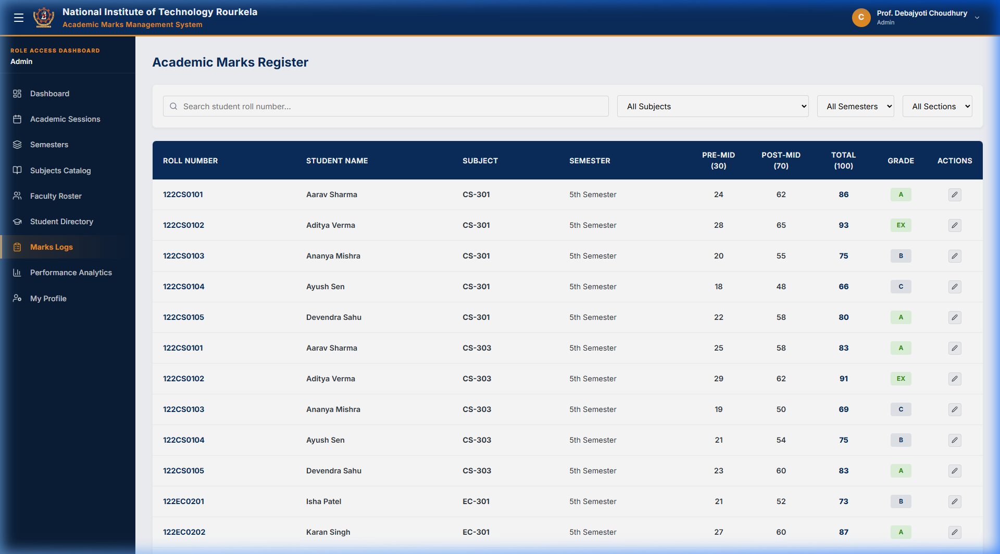 |

### 5. Performance Reports & Analytics
| Analytics & Transcripts | Subject-wise SVG Bar Chart |
| :---: | :---: |
| 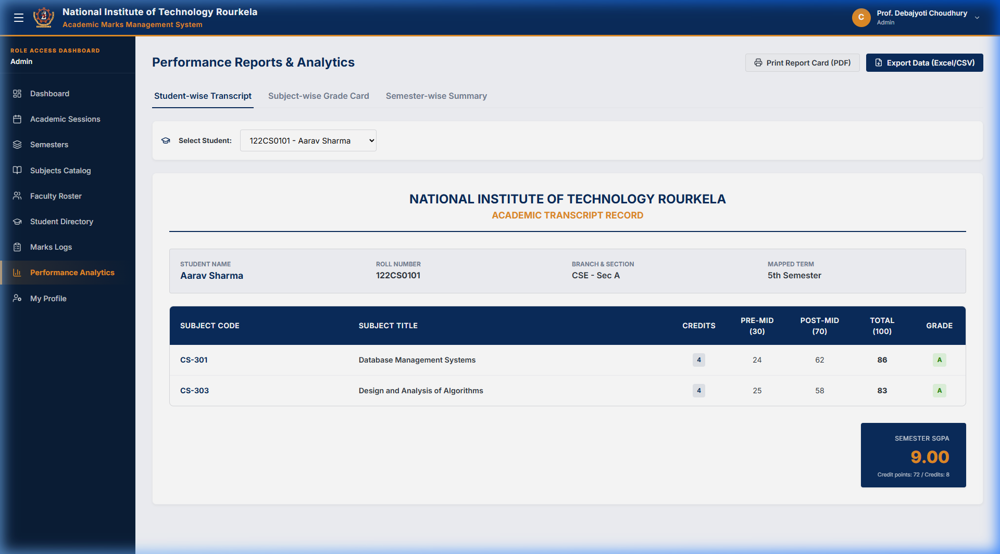 | 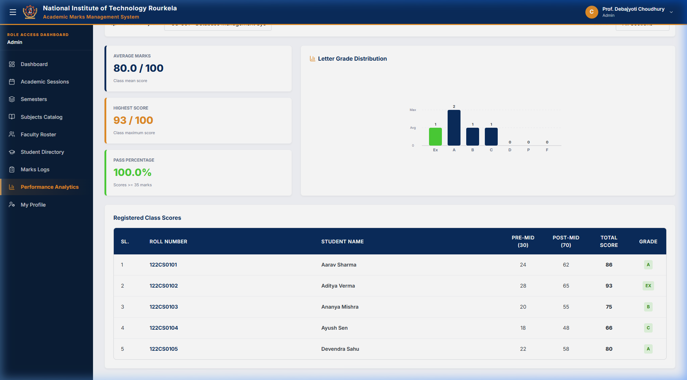 |

### 6. Profile & Coordinator Marks Entry
| Profile Settings | Coordinator Marks Entry Sheet |
| :---: | :---: |
| 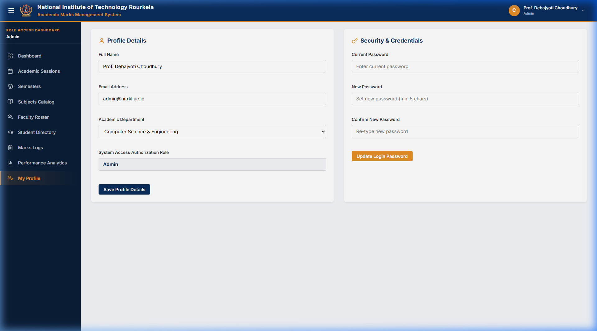 | 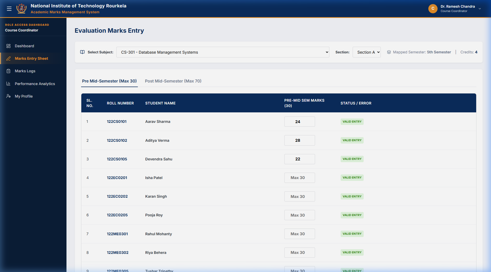 |

---

## 🛠️ Tech Stack

- **Frontend Core**: React (Vite-powered Single Page Application)
- **Styling**: Vanilla CSS (Custom design system variables, grids, transitions, responsive drawers)
- **Icons**: Lucide React
- **Database Connectivity**: Firebase Web SDK (v9/v10 Firestore & Auth)
- **State/Caching Persistence**: React Context APIs synchronized with browser `LocalStorage` (automatic database fallback mode for easy offline grading).

---

## 🔑 Demo Access Credentials

The login panel includes a **Quick Access Demo Accounts** helper card, but you can also log in manually using:

| System Role | Email Address | Password | Purpose / Scoped Access |
| :--- | :--- | :--- | :--- |
| **System Admin** | `admin@nitrkl.ac.in` | `admin123` | Session, Semester, Subject, Student, & Faculty CRUD configurations. |
| **Course Coordinator** | `cc1@nitrkl.ac.in` | `cc123` | Map sub-coordinators, input marks for CS-301 & CS-303, view class transcripts & CSV exports. |
| **Sub-Coordinator** | `sc1@nitrkl.ac.in` | `sub123` | Enter & update marks for mapped CSE student section databases. |

---

## 📂 Project Structure

```
nitr-marks-management-system/
├── database_schema.md                   (DDL SQL Schema and Firestore layouts)
├── package.json                         (Build scripts and dependencies)
├── vite.config.js                       (Vite server configurations)
├── index.html                           (Core page viewport and branding metadata)
└── src/
    ├── main.jsx                         (Vite compiler loader)
    ├── App.jsx                          (Tab router layout & role-based route guard)
    ├── index.css                        (Vanilla CSS variable tokens & UI class layouts)
    ├── firebase.js                      (Firebase client & firestore init script)
    ├── assets/
    │   └── logo.svg                     (NIT Rourkela circular crest logo)
    ├── services/
    │   └── api.js                       (LocalStorage-based REST API service with 20 student seeds)
    ├── context/
    │   ├── AuthContext.jsx              (Encapsulates login session & authorization states)
    │   └── AcademicContext.jsx          (Global CRUD store manager synced across portals)
    ├── components/
    │   ├── Navbar.jsx                   (NITR branding panel, toggler, & user signout)
    │   └── Sidebar.jsx                  (Role-based dark navigational menu panel)
    └── pages/
        ├── Login.jsx                    (ERP Login with quick-fill demo buttons)
        ├── Dashboard.jsx                (System stat metrics and audit logs)
        ├── SessionManagement.jsx        (Create & Activate academic terms)
        ├── SemesterManagement.jsx       (Configure semester stages)
        ├── SubjectManagement.jsx        (Subject registries, Coordinator mappings)
        ├── FacultyManagement.jsx        (Register faculty roles)
        ├── StudentManagement.jsx        (Student registries with filters)
        ├── MarksEntry.jsx               (Dual-tab evaluation marks sheet)
        ├── MarksManagement.jsx          (Global scores register, update card)
        ├── Reports.jsx                  (SGPA transcript cards, live SVG Bar Charts)
        └── Profile.jsx                  (Profile settings & credentials updates)
```

---

## ⚙️ Local Development Setup

### Prerequisites
Make sure you have [Node.js](https://nodejs.org/) installed (version 16 or above recommended).

### Steps to Run
1. **Clone or Extract the Project Directory**
   ```bash
   cd nitr-marks-management-system
   ```

2. **Install Dependencies**
   Installs `react`, `lucide-react`, and `firebase`:
   ```bash
   npm install
   ```

3. **Launch Local Dev Server**
   ```bash
   npm run dev
   ```
   Open the local port url printed in your terminal (typically `http://localhost:5173`) in your web browser.

4. **Compile Production Bundle**
   ```bash
   npm run build
   ```

---

## ⚡ Connecting to Firebase

To connect the application to your live Firebase Cloud Database instead of the offline LocalStorage mode:

1. Open a new project on the [Firebase Console](https://console.firebase.google.com/).
2. Create a Firestore Database and enable Authentication (Email/Password sign-in).
3. Create a `.env` file in the project root:
   ```env
   VITE_FIREBASE_API_KEY="your-api-key-here"
   VITE_FIREBASE_AUTH_DOMAIN="your-auth-domain-here"
   VITE_FIREBASE_PROJECT_ID="your-project-id"
   VITE_FIREBASE_STORAGE_BUCKET="your-storage-bucket"
   VITE_FIREBASE_MESSAGING_SENDER_ID="your-sender-id"
   VITE_FIREBASE_APP_ID="your-app-id"
   ```
4. Restart your development server. The system will detect the environment keys and dynamically connect to your cloud database!
