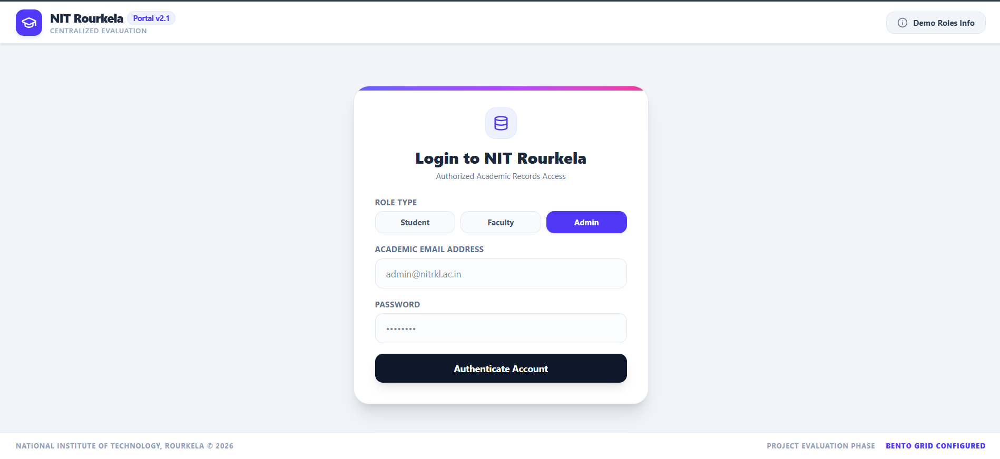
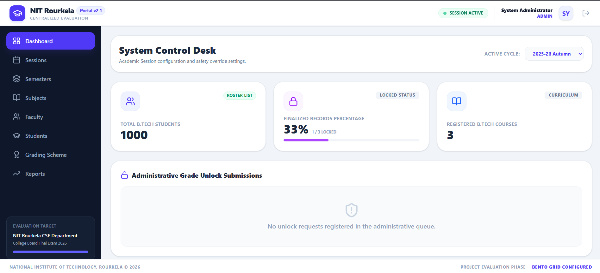
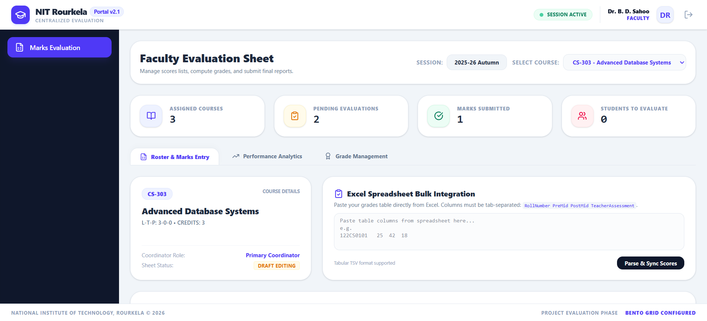
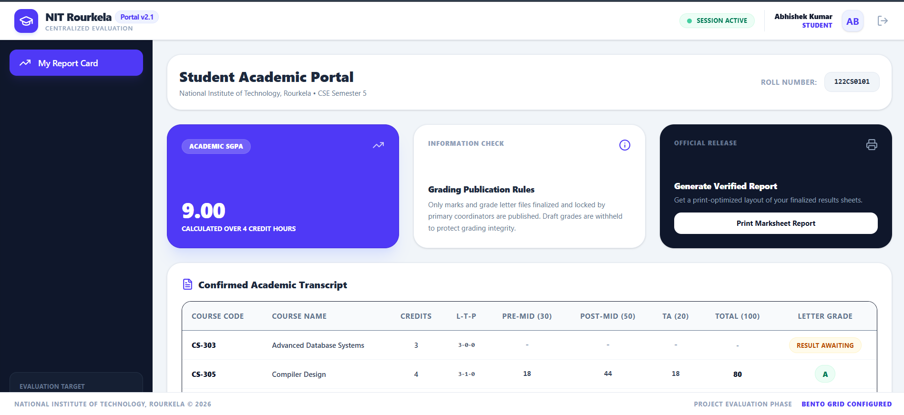

# NITR Marks Management System

A centralized, role‑based marks management system for NIT Rourkela. It streamlines handling of students, subjects, academic sessions, and both Pre‑Mid‑Semester and Post‑Mid‑Semester assessment records.

---

## ✨ Features
- **Role‑Based Access**: Admin, faculty, and student views.
- **Student & Subject Management**: CRUD operations with validation.
- **Session Handling**: Academic year and semester organization.
- **Assessment Records**: Record, edit, and view pre‑mid and post‑mid marks.
- **Export / Import**: CSV export for reports and bulk data import.
- **Responsive UI**: Clean interface built with modern web technologies.

---

## 🛠️ Tech Stack
- **Backend**: Node.js with Express (or Django/Flask – adapt as needed)
- **Database**: PostgreSQL (or MySQL) for relational data integrity
- **Frontend**: HTML5, CSS3 (with a premium design), JavaScript (ES6+)
- **Version Control**: Git

---

## 🚀 Usage
- **Admin**: user_name=admin@nitrkl.ac.in ,password= adminpassword ,Access the dashboard to manage users, subjects, and sessions.
- **Faculty**: user_name=bdsahoo@nitrkl.ac.in ,password=password123 ,Enter and edit assessment records for assigned classes.
- **Student**: user_name=abhishek2nitrkl.ac.in ,password=password123 ,View personal marks and academic progress.

---

